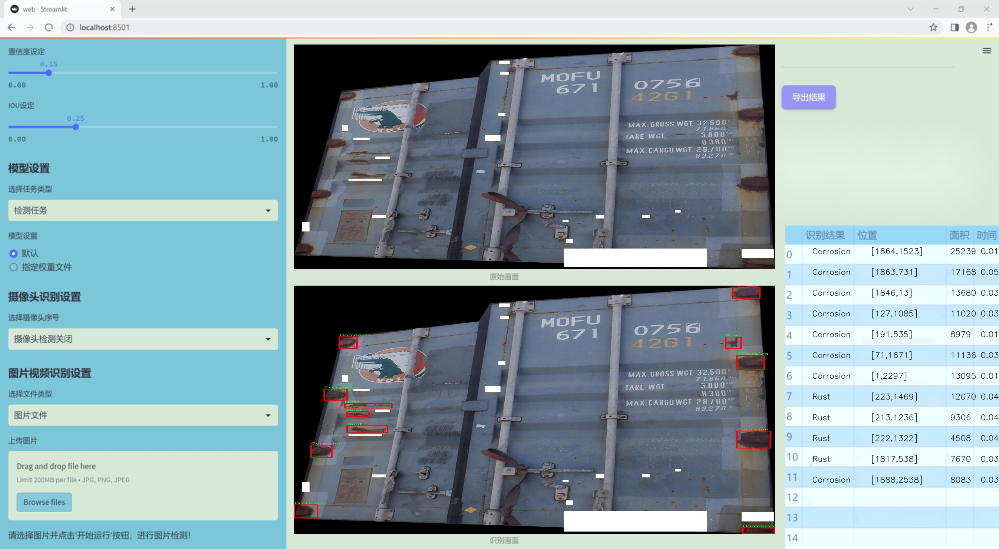
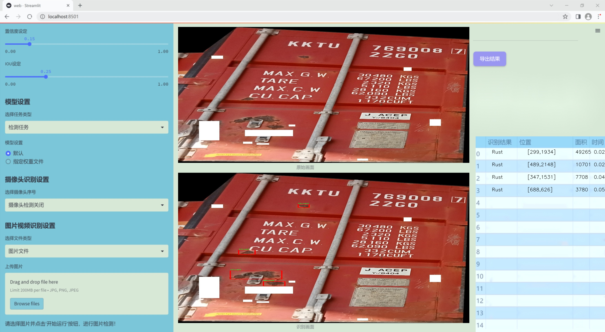
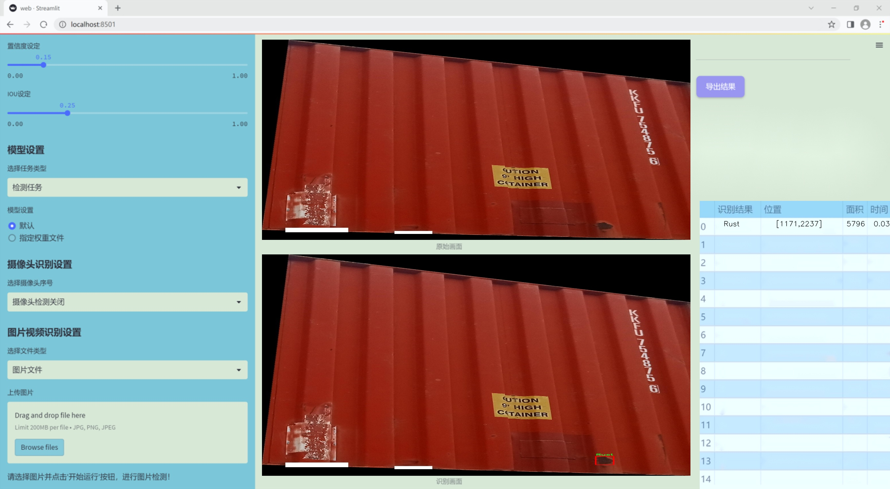
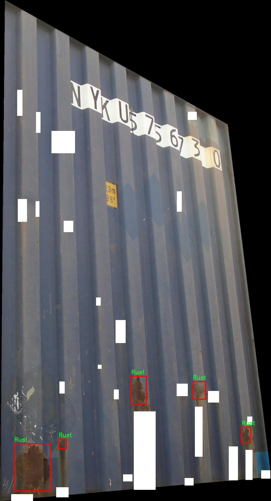
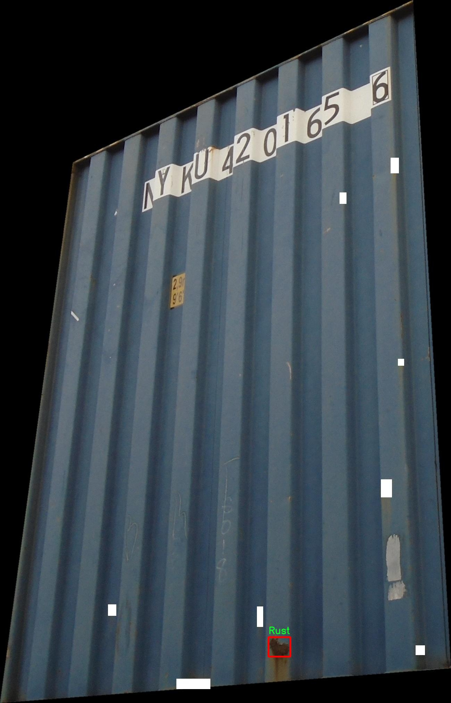
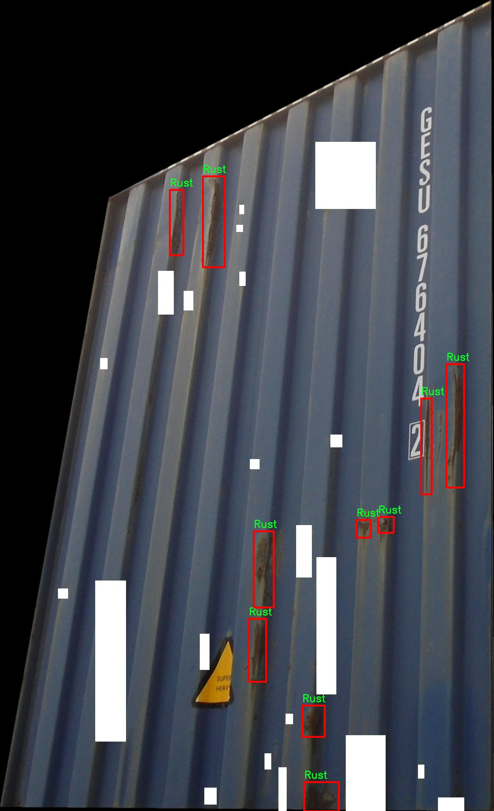
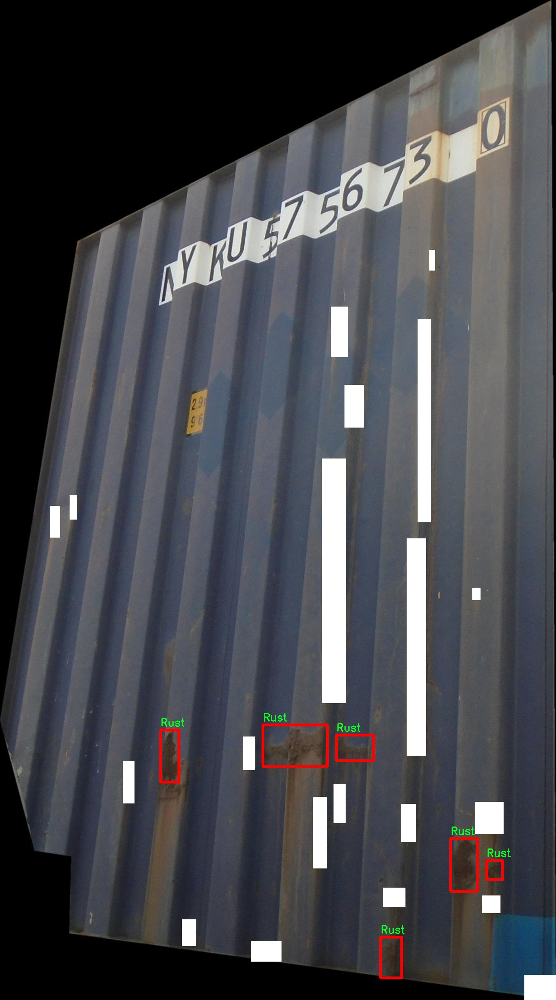
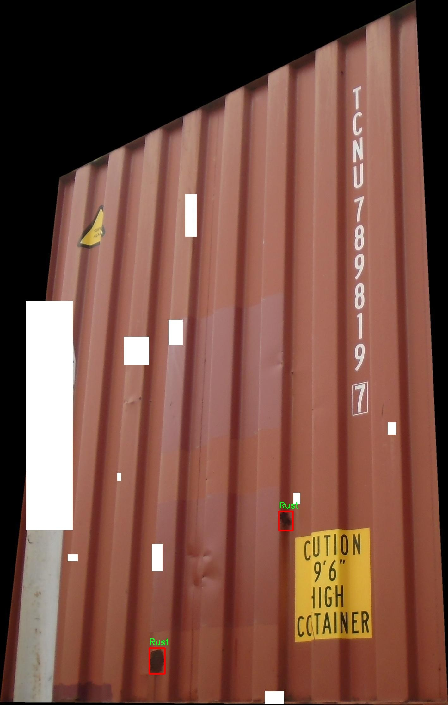

# 改进yolo11-RepNCSPELAN_CAA等200+全套创新点大全：集装箱表面腐蚀检测系统源码＆数据集全套

### 1.图片效果展示







##### 项目来源 **[人工智能促进会 2024.11.01](https://kdocs.cn/l/cszuIiCKVNis)**

注意：由于项目一直在更新迭代，上面“1.图片效果展示”和“2.视频效果展示”展示的系统图片或者视频可能为老版本，新版本在老版本的基础上升级如下：（实际效果以升级的新版本为准）

  （1）适配了YOLOV11的“目标检测”模型和“实例分割”模型，通过加载相应的权重（.pt）文件即可自适应加载模型。

  （2）支持“图片识别”、“视频识别”、“摄像头实时识别”三种识别模式。

  （3）支持“图片识别”、“视频识别”、“摄像头实时识别”三种识别结果保存导出，解决手动导出（容易卡顿出现爆内存）存在的问题，识别完自动保存结果并导出到tempDir中。

  （4）支持Web前端系统中的标题、背景图等自定义修改。

  另外本项目提供训练的数据集和训练教程,暂不提供权重文件（best.pt）,需要您按照教程进行训练后实现图片演示和Web前端界面演示的效果。

### 2.视频效果展示

[2.1 视频效果展示](https://www.bilibili.com/video/BV12PDPYWEiA/)

### 3.背景

研究背景与意义

随着全球贸易的迅速发展，集装箱作为国际物流的重要载体，其安全性和可靠性日益受到重视。集装箱在海洋运输过程中，常常暴露于恶劣的环境条件下，如高湿度、盐雾和温差变化等，这些因素极易导致集装箱表面发生腐蚀和锈蚀现象。腐蚀不仅影响集装箱的外观，还可能对其结构强度造成严重威胁，进而影响货物的安全。因此，及时、准确地检测集装箱表面的腐蚀情况，对于维护集装箱的使用寿命和确保运输安全具有重要意义。

传统的人工检测方法不仅效率低下，而且容易受到人为因素的影响，导致漏检和误检的情况发生。近年来，随着计算机视觉和深度学习技术的迅猛发展，基于图像处理的自动化检测系统逐渐成为研究热点。YOLO（You Only Look Once）系列目标检测算法因其高效性和实时性，广泛应用于各种物体检测任务。YOLOv11作为该系列的最新版本，具备更强的特征提取能力和更快的检测速度，适合于处理复杂的图像数据。

本研究旨在基于改进的YOLOv11算法，构建一个集装箱表面腐蚀检测系统。我们将利用“Rust_Corrosion_Front_Door_Zoom_Out_yolo_filter_noise_NA_20220719”数据集，该数据集包含108幅图像，涵盖了腐蚀和锈蚀两类目标。通过对该数据集的深入分析和模型训练，我们期望能够提高腐蚀检测的准确性和效率，从而为集装箱的维护和管理提供有力支持。该研究不仅具有重要的理论价值，也为实际应用提供了可行的解决方案，推动了智能检测技术在物流行业的应用进程。

### 4.数据集信息展示

##### 4.1 本项目数据集详细数据（类别数＆类别名）

nc: 2
names: ['Corrosion', 'Rust']


该项目为【目标检测】数据集，请在【训练教程和Web端加载模型教程（第三步）】这一步的时候按照【目标检测】部分的教程来训练

##### 4.2 本项目数据集信息介绍

本项目数据集信息介绍

本项目所使用的数据集名为“Rust_Corrosion_Front_Door_Zoom_Out_yolo_filter_noise_NA_20220719”，专门用于训练和改进YOLOv11模型，以实现高效的集装箱表面腐蚀检测。该数据集包含了丰富的图像数据，旨在为模型提供多样化的训练样本，从而提升其在实际应用中的检测准确性和鲁棒性。数据集中共包含两类目标，分别为“Corrosion”（腐蚀）和“Rust”（锈蚀），这两类目标在集装箱表面腐蚀检测中具有重要的实际意义。

数据集中的图像经过精心挑选，涵盖了不同光照条件、角度和背景的样本，以确保模型能够在各种环境下有效识别腐蚀和锈蚀现象。每一张图像都经过标注，明确指出了腐蚀和锈蚀的具体位置，这为模型的训练提供了必要的监督信息。此外，数据集还经过噪声过滤处理，以减少背景干扰，提高目标检测的准确性。

通过使用该数据集，YOLOv11模型能够学习到腐蚀和锈蚀的特征，进而在实际应用中实现对集装箱表面状态的快速评估。随着集装箱运输业的不断发展，集装箱表面的腐蚀问题日益突出，及时发现和处理这些问题对于确保运输安全和降低维护成本至关重要。因此，本项目的数据集不仅具有重要的学术价值，也为实际工业应用提供了强有力的支持。通过对“Rust_Corrosion_Front_Door_Zoom_Out_yolo_filter_noise_NA_20220719”数据集的深入研究和应用，我们期望能够显著提升集装箱表面腐蚀检测的效率和准确性，为相关领域的研究和实践提供新的思路和方法。











### 5.全套项目环境部署视频教程（零基础手把手教学）

[5.1 所需软件PyCharm和Anaconda安装教程（第一步）](https://www.bilibili.com/video/BV1BoC1YCEKi/?spm_id_from=333.999.0.0&vd_source=bc9aec86d164b67a7004b996143742dc)


[5.2 安装Python虚拟环境创建和依赖库安装视频教程（第二步）](https://www.bilibili.com/video/BV1ZoC1YCEBw?spm_id_from=333.788.videopod.sections&vd_source=bc9aec86d164b67a7004b996143742dc)

### 6.改进YOLOv11训练教程和Web_UI前端加载模型教程（零基础手把手教学）

[6.1 改进YOLOv11训练教程和Web_UI前端加载模型教程（第三步）](https://www.bilibili.com/video/BV1BoC1YCEhR?spm_id_from=333.788.videopod.sections&vd_source=bc9aec86d164b67a7004b996143742dc)


按照上面的训练视频教程链接加载项目提供的数据集，运行train.py即可开始训练



     Epoch   gpu_mem       box       obj       cls    labels  img_size
     1/200     20.8G   0.01576   0.01955  0.007536        22      1280: 100%|██████████| 849/849 [14:42<00:00,  1.04s/it]
               Class     Images     Labels          P          R     mAP@.5 mAP@.5:.95: 100%|██████████| 213/213 [01:14<00:00,  2.87it/s]
                 all       3395      17314      0.994      0.957      0.0957      0.0843

     Epoch   gpu_mem       box       obj       cls    labels  img_size
     2/200     20.8G   0.01578   0.01923  0.007006        22      1280: 100%|██████████| 849/849 [14:44<00:00,  1.04s/it]
               Class     Images     Labels          P          R     mAP@.5 mAP@.5:.95: 100%|██████████| 213/213 [01:12<00:00,  2.95it/s]
                 all       3395      17314      0.996      0.956      0.0957      0.0845

     Epoch   gpu_mem       box       obj       cls    labels  img_size
     3/200     20.8G   0.01561    0.0191  0.006895        27      1280: 100%|██████████| 849/849 [10:56<00:00,  1.29it/s]
               Class     Images     Labels          P          R     mAP@.5 mAP@.5:.95: 100%|███████   | 187/213 [00:52<00:00,  4.04it/s]
                 all       3395      17314      0.996      0.957      0.0957      0.0845


###### [项目数据集下载链接](https://kdocs.cn/l/cszuIiCKVNis)

### 7.原始YOLOv11算法讲解

##### YOLO11简介

> YOLO11源码地址：https://github.com/ultralytics/ultralytics

Ultralytics
YOLO11是一款尖端的、最先进的模型，它在之前YOLO版本成功的基础上进行了构建，并引入了新功能和改进，以进一步提升性能和灵活性。YOLO11设计快速、准确且易于使用，使其成为各种物体检测和跟踪、实例分割、图像分类以及姿态估计任务的绝佳选择。  


**YOLO11创新点如下:**

YOLO 11主要改进包括：  
`增强的特征提取`：YOLO 11采用了改进的骨干和颈部架构，增强了特征提取功能，以实现更精确的目标检测。  
`优化的效率和速度`：优化的架构设计和优化的训练管道提供更快的处理速度，同时保持准确性和性能之间的平衡。  
`更高的精度，更少的参数`：YOLO11m在COCO数据集上实现了更高的平均精度（mAP），参数比YOLOv8m少22%，使其在不影响精度的情况下提高了计算效率。  
`跨环境的适应性`：YOLO 11可以部署在各种环境中，包括边缘设备、云平台和支持NVIDIA GPU的系统。  
`广泛的支持任务`：YOLO 11支持各种计算机视觉任务，如对象检测、实例分割、图像分类、姿态估计和面向对象检测（OBB）。

**YOLO11不同模型尺寸信息：**

YOLO11 提供5种不同的型号规模模型，以满足不同的应用需求：

Model| size (pixels)| mAPval 50-95| Speed CPU ONNX (ms)| Speed T4 TensorRT10
(ms)| params (M)| FLOPs (B)  
---|---|---|---|---|---|---  
YOLO11n| 640| 39.5| 56.1 ± 0.8| 1.5 ± 0.0| 2.6| 6.5  
YOLO11s| 640| 47.0| 90.0 ± 1.2| 2.5 ± 0.0| 9.4| 21.5  
YOLO11m| 640| 51.5| 183.2 ± 2.0| 4.7 ± 0.1| 20.1| 68.0  
YOLO11l| 640| 53.4| 238.6 ± 1.4| 6.2 ± 0.1| 25.3| 86.9  
YOLO11x| 640| 54.7| 462.8 ± 6.7| 11.3 ± 0.2| 56.9| 194.9  
  
**模型常用训练超参数参数说明：**  
`YOLOv11
模型的训练设置包括训练过程中使用的各种超参数和配置`。这些设置会影响模型的性能、速度和准确性。关键的训练设置包括批量大小、学习率、动量和权重衰减。此外，优化器、损失函数和训练数据集组成的选择也会影响训练过程。对这些设置进行仔细的调整和实验对于优化性能至关重要。  
**以下是一些常用的模型训练参数和说明：**

参数名| 默认值| 说明  
---|---|---  
`model`| `None`| 指定用于训练的模型文件。接受指向 `.pt` 预训练模型或 `.yaml`
配置文件。对于定义模型结构或初始化权重至关重要。  
`data`| `None`| 数据集配置文件的路径（例如
`coco8.yaml`).该文件包含特定于数据集的参数，包括训练数据和验证数据的路径、类名和类数。  
`epochs`| `100`| 训练总轮数。每个epoch代表对整个数据集进行一次完整的训练。调整该值会影响训练时间和模型性能。  
`patience`| `100`| 在验证指标没有改善的情况下，提前停止训练所需的epoch数。当性能趋于平稳时停止训练，有助于防止过度拟合。  
`batch`| `16`| 批量大小，有三种模式:设置为整数(例如，’ Batch =16 ‘)， 60% GPU内存利用率的自动模式(’ Batch
=-1 ‘)，或指定利用率分数的自动模式(’ Batch =0.70 ')。  
`imgsz`| `640`| 用于训练的目标图像尺寸。所有图像在输入模型前都会被调整到这一尺寸。影响模型精度和计算复杂度。  
`device`| `None`| 指定用于训练的计算设备：单个 GPU (`device=0`）、多个 GPU (`device=0,1`)、CPU
(`device=cpu`)，或苹果芯片的 MPS (`device=mps`).  
`workers`| `8`| 加载数据的工作线程数（每 `RANK` 多 GPU 训练）。影响数据预处理和输入模型的速度，尤其适用于多 GPU 设置。  
`name`| `None`| 训练运行的名称。用于在项目文件夹内创建一个子目录，用于存储训练日志和输出结果。  
`pretrained`| `True`| 决定是否从预处理模型开始训练。可以是布尔值，也可以是加载权重的特定模型的字符串路径。提高训练效率和模型性能。  
`optimizer`| `'auto'`| 为训练模型选择优化器。选项包括 `SGD`, `Adam`, `AdamW`, `NAdam`,
`RAdam`, `RMSProp` 等，或 `auto` 用于根据模型配置进行自动选择。影响收敛速度和稳定性  
`lr0`| `0.01`| 初始学习率（即 `SGD=1E-2`, `Adam=1E-3`) .调整这个值对优化过程至关重要，会影响模型权重的更新速度。  
`lrf`| `0.01`| 最终学习率占初始学习率的百分比 = (`lr0 * lrf`)，与调度程序结合使用，随着时间的推移调整学习率。  


**各损失函数作用说明：**  
`定位损失box_loss`：预测框与标定框之间的误差（GIoU），越小定位得越准；  
`分类损失cls_loss`：计算锚框与对应的标定分类是否正确，越小分类得越准；  
`动态特征损失（dfl_loss）`：DFLLoss是一种用于回归预测框与目标框之间距离的损失函数。在计算损失时，目标框需要缩放到特征图尺度，即除以相应的stride，并与预测的边界框计算Ciou
Loss，同时与预测的anchors中心点到各边的距离计算回归DFLLoss。  


### 8.200+种全套改进YOLOV11创新点原理讲解

#### 8.1 200+种全套改进YOLOV11创新点原理讲解大全

由于篇幅限制，每个创新点的具体原理讲解就不全部展开，具体见下列网址中的改进模块对应项目的技术原理博客网址【Blog】（创新点均为模块化搭建，原理适配YOLOv5~YOLOv11等各种版本）

[改进模块技术原理博客【Blog】网址链接](https://gitee.com/qunmasj/good)


#### 8.2 精选部分改进YOLOV11创新点原理讲解

###### 这里节选部分改进创新点展开原理讲解(完整的改进原理见上图和[改进模块技术原理博客链接](https://gitee.com/qunmasj/good)【如果此小节的图加载失败可以通过CSDN或者Github搜索该博客的标题访问原始博客，原始博客图片显示正常】


### 感受野注意力卷积（RFAConv)
#### 标准卷积操作回顾
标准的卷积操作是构造卷积神经网络的基本构件。它利用具有共享参数的滑动窗口提取特征信息，克服了全连通层构造神经网络固有的参数多、计算开销大的问题。设 X R∈C×H×W
表示输入特征图，其中C、H、W分别表示特征图的通道数、高度、宽度。为了清楚地演示卷积核的特征提取过程，我们使用 C = 1 的例子。从每个接受域滑块中提取特征信息的卷积运算可以表示为:


这里，Fi 表示计算后每个卷积滑块得到的值，Xi 表示每个滑块内对应位置的像素值，K表示卷积核，S表示卷积核中的参数个数，N表示接收域滑块的总数。可以看出，每个滑块内相同位置的 feature共享相同的参数Ki。因此，标准的卷积运算并不能捕捉到不同位置所带来的信息差异，这最终在一定程度上限制了卷积神经网络的性能。 

#### 空间注意力回顾
目前，空间注意机制是利用学习得到的注意图来突出每个特征的重要性。与前一节类似，这里以 C=1为例。突出关键特征的空间注意机制可以简单表述为:这里，Fi 表示加权运算后得到的值。xi 和Ai 表示输入特征图和学习到的注意图在不同位置的值，N为输入特征图的高和宽的乘积，表示像素值的总数。


#### 空间注意与标准卷积运算
将注意力机制整合到卷积神经网络中，可以提高卷积神经网络的性能。通过对标准卷积运算和现有空间注意机制的研究，我们认为空间注意机制有效地克服了卷积神经网络固有的参数共享的局限性。目前卷积神经网络中最常用的核大小是 1 × 1和3 × 3。在引入空间注意机制后，提取特征的卷积操作可以是 1 × 1或3 × 3卷积操作。为了直观地展示这个过程，在 1 × 1卷积运算的前面插入了空间注意机制。通过注意图对输入特征图(Re-weight“×”)进行加权运算，最后通过 1 × 1卷积运算提取接收域的滑块特征信息。整个过程可以简单地表示如下:


 这里卷积核K仅代表一个参数值。如果取A i× ki 的值作为一种新的卷积核参数，有趣的是它解决了 1×1卷积运算提取特征时的参数共享问题。然而，关于空间注意机制的传说到此结束。当空间注意机制被插入到3×3卷积运算前面时。具体情况如下:


如上所述，如果取A的值 i × ki (4)式作为一种新的卷积核参数，完全解决了大规模卷积核的参数共享问题。然而，最重要的一点是，卷积核在提取每个接受域滑块的特征时，会共享一些特征。换句话说，每个接收域滑块内都有一个重叠。仔细分析后会发现A12= a21， a13 = a22， a15 = a24……，在这种情况下，每个滑动窗口共享空间注意力地图的权重。因此，空间注意机制没有考虑整个接受域的空间特征，不能有效地解决大规模卷积核的参数共享问题。因此，空间注意机制的有效性受到限制。 

#### 创新空间注意力和标准卷积操作
该博客提出解决了现有空间注意机制的局限性，为空间处理提供了一种创新的解决方案。受RFA的启发，一系列空间注意机制被开发出来，可以进一步提高卷积神经网络的性能。RFA可以看作是一个轻量级即插即用模块，RFA设计的卷积运算(RFAConv)可以代替标准卷积来提高卷积神经网络的性能。因此，我们预测空间注意机制与标准卷积运算的结合将继续发展，并在未来带来新的突破。
接受域空间特征:为了更好地理解接受域空间特征的概念，我们将提供相关的定义。接收域空间特征是专门为卷积核设计的，并根据核大小动态生成。如图1所示，以3×3卷积核为例。在图1中，“Spatial Feature”指的是原始的Feature map。“接受域空间特征”是空间特征变换后的特征图。

 

由不重叠的滑动窗口组成。当使用 3×3卷积内核提取特征时，接收域空间特征中的每个 3×3大小窗口代表一个接收域滑块。接受域注意卷积(RFAConv):针对接受域的空间特征，我们提出了接受域注意卷积(RFA)。该方法不仅强调了接收域滑块内不同特征的重要性，而且对接收域空间特征进行了优先排序。通过该方法，完全解决了卷积核参数共享的问题。接受域空间特征是根据卷积核的大小动态生成的，因此，RFA是卷积的固定组合，不能与卷积操作的帮助分离，卷积操作同时依赖于RFA来提高性能，因此我们提出了接受场注意卷积(RFAConv)。具有3×3大小的卷积核的RFAConv整体结构如图所示。


目前，最广泛使用的接受域特征提取方法是缓慢的。经过大量的研究，我们开发了一种快速的方法，用分组卷积来代替原来的方法。具体来说，我们利用相应大小的分组卷积来动态生成基于接受域大小的展开特征。尽管与原始的无参数方法(如PyTorch提供的nn.())相比，该方法增加了一些参数，但它的速度要快得多。注意:如前一节所述，当使用 3×3卷积内核提取特征时，接收域空间特征中的每个 3×3大小窗口表示一个接收域滑块。而利用快速分组卷积提取感受野特征后，将原始特征映射为新的特征。最近的研究表明。交互信息可以提高网络性能，如[40,41,42]所示。同样，对于RFAConv来说，通过交互接受域特征信息来学习注意图可以提高网络性能。然而，与每个接收域特征交互会导致额外的计算开销，因此为了最小化计算开销和参数的数量，我们使用AvgPool来聚合每个接收域特征的全局信息。然后，使用 1×1 组卷积操作进行信息交互。最后，我们使用softmax来强调每个特征在接受域特征中的重要性。一般情况下，RFA的计算可以表示为:


这里gi×i 表示一个大小为 i×i的分组卷积，k表示卷积核的大小，Norm表示归一化，X表示输入的特征图，F由注意图 a相乘得到 rf 与转换后的接受域空间特征 Frf。与CBAM和CA不同，RFA能够为每个接受域特征生成注意图。卷积神经网络的性能受到标准卷积操作的限制，因为卷积操作依赖于共享参数，对位置变化带来的信息差异不敏感。然而，RFAConv通过强调接收域滑块中不同特征的重要性，并对接收域空间特征进行优先级排序，可以完全解决这个问题。通过RFA得到的feature map是接受域空间特征，在“Adjust Shape”后没有重叠。因此，学习到的注意图将每个接受域滑块的特征信息聚合起来。换句话说，注意力地图不再共享在每个接受域滑块。这完全弥补了现有 CA和CBAM注意机制的不足。RFA为标准卷积内核提供了显著的好处。而在调整形状后，特征的高度和宽度是 k倍，需要进行 stride = k的k × k卷积运算来提取特征信息。RFA设计的卷积运算RFAConv为卷积带来了良好的增益，对标准卷积进行了创新。
此外，我们认为现有的空间注意机制应该优先考虑接受域空间特征，以提高网络性能。众所周知，基于自注意机制的网络模型[43,44,45]取得了很大的成功，因为它解决了卷积参数共享的问题，并对远程信息进行建模。然而，自注意机制也为模型引入了显著的计算开销和复杂性。我们认为，将现有的空间注意机制的注意力引导到接受场空间特征上，可以以类似于自我注意的方式解决长期信息的参数共享和建模问题。与自我关注相比，这种方法需要的参数和计算资源少得多。答案如下:(1)将以接收场空间特征为中心的空间注意机制与卷积相结合，消除了卷积参数共享的问题。(2)现有的空间注意机制已经考虑了远程信息，可以通过全局平均池或全局最大池的方式获取全局信息，其中明确考虑了远程信息。因此，我们设计了新的 CBAM和CA模型，称为RFCBAM和RFCA，它们专注于接受域空间特征。与RFA类似，使用最终的k × k stride = k 的卷积运算来提取特征信息。这两种新的卷积方法的具体结构如图 3所示，我们称这两种新的卷积操作为 RFCBAMConv和RFCAConv。与原来的CBAM相比，我们在RFCBAM中使用SE attention来代替CAM。因为这样可以减少计算开销。此外，在RFCBAM中，通道注意和空间注意不是分开执行的。相反，它们是同时加权的，使得每个通道获得的注意力地图是不同的。


### 9.系统功能展示

图9.1.系统支持检测结果表格显示

  图9.2.系统支持置信度和IOU阈值手动调节

  图9.3.系统支持自定义加载权重文件best.pt(需要你通过步骤5中训练获得)

  图9.4.系统支持摄像头实时识别

  图9.5.系统支持图片识别

  图9.6.系统支持视频识别

  图9.7.系统支持识别结果文件自动保存

  图9.8.系统支持Excel导出检测结果数据


### 10. YOLOv11核心改进源码讲解

#### 10.1 utils.py

以下是经过简化和注释的核心代码部分，保留了多尺度可变形注意力机制的实现以及一些重要的初始化函数：

```python
# Ultralytics YOLO 🚀, AGPL-3.0 license
"""模块工具函数."""

import copy
import math
import numpy as np
import torch
import torch.nn as nn
import torch.nn.functional as F
from torch.nn.init import uniform_

__all__ = "multi_scale_deformable_attn_pytorch", "inverse_sigmoid"

def inverse_sigmoid(x, eps=1e-5):
    """计算张量的反sigmoid函数."""
    # 限制x的范围在[0, 1]之间
    x = x.clamp(min=0, max=1)
    # 为了避免log(0)，对x进行限制
    x1 = x.clamp(min=eps)
    x2 = (1 - x).clamp(min=eps)
    # 返回反sigmoid值
    return torch.log(x1 / x2)

def multi_scale_deformable_attn_pytorch(
    value: torch.Tensor,
    value_spatial_shapes: torch.Tensor,
    sampling_locations: torch.Tensor,
    attention_weights: torch.Tensor,
) -> torch.Tensor:
    """
    多尺度可变形注意力机制.

    参数:
        value: 输入特征张量，形状为 (batch_size, num_features, num_heads, embed_dims)
        value_spatial_shapes: 特征图的空间形状
        sampling_locations: 采样位置，形状为 (batch_size, num_queries, num_heads, num_levels, num_points, 2)
        attention_weights: 注意力权重，形状为 (batch_size, num_heads, num_queries, num_levels, num_points)

    返回:
        输出张量，形状为 (batch_size, num_queries, num_heads * embed_dims)
    """
    bs, _, num_heads, embed_dims = value.shape  # 获取输入张量的维度
    _, num_queries, _, num_levels, num_points, _ = sampling_locations.shape  # 获取采样位置的维度

    # 将输入特征分割成不同的空间层次
    value_list = value.split([H_ * W_ for H_, W_ in value_spatial_shapes], dim=1)
    # 将采样位置映射到[-1, 1]的范围
    sampling_grids = 2 * sampling_locations - 1
    sampling_value_list = []

    # 遍历每个空间层次
    for level, (H_, W_) in enumerate(value_spatial_shapes):
        # 处理每个层次的特征
        value_l_ = value_list[level].flatten(2).transpose(1, 2).reshape(bs * num_heads, embed_dims, H_, W_)
        # 获取当前层次的采样网格
        sampling_grid_l_ = sampling_grids[:, :, :, level].transpose(1, 2).flatten(0, 1)
        # 使用grid_sample进行双线性插值采样
        sampling_value_l_ = F.grid_sample(
            value_l_, sampling_grid_l_, mode="bilinear", padding_mode="zeros", align_corners=False
        )
        sampling_value_list.append(sampling_value_l_)

    # 处理注意力权重
    attention_weights = attention_weights.transpose(1, 2).reshape(
        bs * num_heads, 1, num_queries, num_levels * num_points
    )
    
    # 计算最终输出
    output = (
        (torch.stack(sampling_value_list, dim=-2).flatten(-2) * attention_weights)
        .sum(-1)
        .view(bs, num_heads * embed_dims, num_queries)
    )
    
    return output.transpose(1, 2).contiguous()  # 返回输出，调整维度顺序
```

### 代码说明：
1. **inverse_sigmoid**：实现了反sigmoid函数，用于将输入张量转换为概率空间的反函数，避免了计算中的零值问题。
2. **multi_scale_deformable_attn_pytorch**：实现了多尺度可变形注意力机制。该函数通过对输入特征进行空间分割，计算采样位置的双线性插值，结合注意力权重，最终输出加权后的特征表示。

这个 `utils.py` 文件是一个用于实现一些深度学习模型中常用的工具函数的模块，主要是针对 Ultralytics YOLO（You Only Look Once）模型的实现。文件中包含了多个函数，涉及模块的克隆、权重初始化、反sigmoid函数的计算以及多尺度可变形注意力机制的实现。

首先，文件导入了一些必要的库，包括 `copy`、`math`、`numpy` 和 `torch`，其中 `torch` 是 PyTorch 框架的核心库，提供了张量操作和深度学习所需的功能。

文件中定义了一个 `_get_clones` 函数，用于根据给定的模块创建一个克隆模块的列表。这个函数使用了 `copy.deepcopy` 方法，确保每个克隆的模块都是独立的，适用于需要多个相同结构但参数不同的网络层的情况。

接下来，`bias_init_with_prob` 函数用于根据给定的先验概率初始化卷积或全连接层的偏置值。它通过对数几率的计算来返回一个合适的偏置初始化值，以便在训练过程中能够更好地学习。

`linear_init` 函数则是用于初始化线性模块的权重和偏置。它使用均匀分布在一个范围内对权重进行初始化，并且如果模块有偏置，则也对偏置进行相同的初始化。

`inverse_sigmoid` 函数计算给定张量的反sigmoid函数。该函数首先将输入张量限制在0到1之间，然后通过对数运算计算反sigmoid值，确保在数值计算中不会出现除以零的情况。

最后，`multi_scale_deformable_attn_pytorch` 函数实现了多尺度可变形注意力机制。该函数接收多个输入，包括值张量、空间形状、采样位置和注意力权重。它首先对输入的值张量进行分割，并计算采样网格。然后，利用 `F.grid_sample` 函数对每个尺度的值进行采样，最后根据注意力权重对采样值进行加权求和，输出最终的注意力结果。

整体来看，这个文件为 YOLO 模型提供了一些基础的工具函数，特别是在处理注意力机制和参数初始化方面，具有很大的实用价值。

#### 10.2 transformer.py

以下是代码中最核心的部分，并附上详细的中文注释：

```python
import torch
import torch.nn as nn
from functools import partial

# 定义线性归一化的函数，使用 LayerNorm 和 RepBN
ln = nn.LayerNorm
linearnorm = partial(LinearNorm, norm1=ln, norm2=RepBN, step=60000)

class TransformerEncoderLayer_RepBN(nn.Module):
    def __init__(self, c1, cm=2048, num_heads=8, dropout=0, act=..., normalize_before=False):
        # 初始化 Transformer 编码器层，设置输入通道数、隐藏层维度、头数、dropout、激活函数等参数
        super().__init__()
        self.norm1 = linearnorm(c1)  # 第一层归一化
        self.norm2 = linearnorm(c1)  # 第二层归一化

class AIFI_RepBN(TransformerEncoderLayer_RepBN):
    """定义 AIFI transformer 层。"""

    def __init__(self, c1, cm=2048, num_heads=8, dropout=0, act=nn.GELU(), normalize_before=False):
        """使用指定参数初始化 AIFI 实例。"""
        super().__init__(c1, cm, num_heads, dropout, act, normalize_before)

    def forward(self, x):
        """AIFI transformer 层的前向传播。"""
        c, h, w = x.shape[1:]  # 获取输入张量的通道数、高度和宽度
        pos_embed = self.build_2d_sincos_position_embedding(w, h, c)  # 构建二维正弦余弦位置嵌入
        # 将输入张量从形状 [B, C, H, W] 展平为 [B, HxW, C]
        x = super().forward(x.flatten(2).permute(0, 2, 1), pos=pos_embed.to(device=x.device, dtype=x.dtype))
        # 将输出张量恢复为原始形状并返回
        return x.permute(0, 2, 1).view([-1, c, h, w]).contiguous()

    @staticmethod
    def build_2d_sincos_position_embedding(w, h, embed_dim=256, temperature=10000.0):
        """构建二维正弦余弦位置嵌入。"""
        assert embed_dim % 4 == 0, "嵌入维度必须是4的倍数，以便进行二维正弦余弦位置嵌入"
        grid_w = torch.arange(w, dtype=torch.float32)  # 创建宽度的网格
        grid_h = torch.arange(h, dtype=torch.float32)  # 创建高度的网格
        grid_w, grid_h = torch.meshgrid(grid_w, grid_h, indexing="ij")  # 生成网格坐标
        pos_dim = embed_dim // 4  # 计算位置维度
        omega = torch.arange(pos_dim, dtype=torch.float32) / pos_dim  # 计算频率
        omega = 1.0 / (temperature**omega)  # 根据温度调整频率

        # 计算宽度和高度的正弦余弦嵌入
        out_w = grid_w.flatten()[..., None] @ omega[None]
        out_h = grid_h.flatten()[..., None] @ omega[None]

        # 返回拼接后的正弦余弦位置嵌入
        return torch.cat([torch.sin(out_w), torch.cos(out_w), torch.sin(out_h), torch.cos(out_h)], 1)[None]
```

### 代码说明：
1. **导入库**：导入了 PyTorch 相关的库和函数。
2. **线性归一化**：使用 `LayerNorm` 和 `RepBN` 定义了一个线性归一化的函数，方便后续使用。
3. **TransformerEncoderLayer_RepBN 类**：继承自 `nn.Module`，初始化时设置了两个归一化层。
4. **AIFI_RepBN 类**：继承自 `TransformerEncoderLayer_RepBN`，实现了 AIFI transformer 层的功能。
5. **前向传播**：在 `forward` 方法中，首先获取输入的形状，然后构建位置嵌入，最后调用父类的 `forward` 方法进行处理，并将输出恢复为原始形状。
6. **构建位置嵌入**：`build_2d_sincos_position_embedding` 方法用于生成二维正弦余弦位置嵌入，确保嵌入维度是4的倍数，并根据输入的宽度和高度计算出位置嵌入。

这个程序文件 `transformer.py` 实现了一个基于 Transformer 架构的编码器层，主要使用了改进的归一化方法（RepBN）和位置编码（2D 正弦余弦位置编码）。文件中定义了两个类：`TransformerEncoderLayer_RepBN` 和 `AIFI_RepBN`。

首先，导入了必要的库，包括 PyTorch 的核心模块和一些自定义的模块。`RepBN` 和 `LinearNorm` 是在其他文件中定义的，可能用于改进模型的归一化过程。

接下来，定义了一个名为 `linearnorm` 的部分函数，它结合了 `LayerNorm` 和 `RepBN`，并设置了一个步长参数（step=60000），用于后续的归一化层创建。

`TransformerEncoderLayer_RepBN` 类继承自 `TransformerEncoderLayer`，并在初始化时调用父类的构造函数，同时定义了两个归一化层 `norm1` 和 `norm2`，这两个层使用了之前定义的 `linearnorm`。

`AIFI_RepBN` 类则是 `TransformerEncoderLayer_RepBN` 的子类，代表了一种特定的 Transformer 层（AIFI）。在其构造函数中，除了传入基本参数外，还默认使用了 GELU 激活函数。它的 `forward` 方法实现了前向传播，首先获取输入张量的形状信息（通道数、宽度和高度），然后调用 `build_2d_sincos_position_embedding` 方法生成 2D 的正弦余弦位置编码。接着，将输入张量从形状 `[B, C, H, W]` 转换为 `[B, HxW, C]`，并调用父类的 `forward` 方法进行处理，最后将输出重新调整为原始的形状。

`build_2d_sincos_position_embedding` 是一个静态方法，用于生成 2D 的正弦余弦位置编码。它首先检查嵌入维度是否能被 4 整除，然后生成宽度和高度的网格，并计算相应的正弦和余弦值，最终返回一个包含这些位置编码的张量。

整体来看，这个文件实现了一个增强型的 Transformer 编码器层，利用了新的归一化技术和位置编码方法，以提高模型的性能和表达能力。

#### 10.3 pkinet.py

以下是经过简化并添加详细中文注释的核心代码部分：

```python
import math
import torch
import torch.nn as nn

class DropPath(nn.Module):
    """实现随机深度（Drop Path）功能的模块，用于在残差块的主路径中随机丢弃路径。"""
    
    def __init__(self, drop_prob: float = 0.1):
        super().__init__()
        self.drop_prob = drop_prob  # 丢弃路径的概率

    def forward(self, x: torch.Tensor) -> torch.Tensor:
        """前向传播，应用丢弃路径的操作。"""
        if self.drop_prob == 0. or not self.training:
            return x  # 如果不丢弃，直接返回输入
        keep_prob = 1 - self.drop_prob
        shape = (x.shape[0], ) + (1, ) * (x.ndim - 1)  # 处理不同维度的张量
        random_tensor = keep_prob + torch.rand(shape, dtype=x.dtype, device=x.device)
        output = x.div(keep_prob) * random_tensor.floor()  # 应用丢弃路径
        return output

class InceptionBottleneck(nn.Module):
    """实现Inception模块的瓶颈结构。"""
    
    def __init__(self, in_channels: int, out_channels: int):
        super().__init__()
        self.pre_conv = nn.Conv2d(in_channels, out_channels, kernel_size=1)  # 预卷积层
        self.dw_conv = nn.Conv2d(out_channels, out_channels, kernel_size=3, padding=1, groups=out_channels)  # 深度卷积
        self.pw_conv = nn.Conv2d(out_channels, out_channels, kernel_size=1)  # 点卷积

    def forward(self, x):
        """前向传播，执行Inception瓶颈操作。"""
        x = self.pre_conv(x)  # 通过预卷积层
        x = self.dw_conv(x)  # 通过深度卷积
        x = self.pw_conv(x)  # 通过点卷积
        return x

class PKINet(nn.Module):
    """实现Poly Kernel Inception网络的主类。"""
    
    def __init__(self, arch: str = 'S'):
        super().__init__()
        self.stem = nn.Conv2d(3, 32, kernel_size=3, stride=2, padding=1)  # Stem层
        self.blocks = nn.ModuleList([
            InceptionBottleneck(32, 64),  # 添加Inception瓶颈块
            InceptionBottleneck(64, 128),
        ])

    def forward(self, x):
        """前向传播，依次通过Stem层和Inception瓶颈块。"""
        x = self.stem(x)  # 通过Stem层
        for block in self.blocks:
            x = block(x)  # 通过每个Inception瓶颈块
        return x

def PKINET_S():
    """构建并返回一个PKINet网络实例。"""
    return PKINet('S')

if __name__ == '__main__':
    model = PKINET_S()  # 创建PKINET_S模型
    inputs = torch.randn((1, 3, 640, 640))  # 生成随机输入
    res = model(inputs)  # 通过模型进行前向传播
    print(res.size())  # 输出结果的尺寸
```

### 代码注释说明：
1. **DropPath**: 实现了随机深度的功能，允许在训练期间随机丢弃某些路径，以增强模型的泛化能力。
2. **InceptionBottleneck**: 该类实现了Inception模块的瓶颈结构，包含预卷积、深度卷积和点卷积的组合，旨在减少参数量和计算量。
3. **PKINet**: 这是主网络类，包含一个Stem层和多个Inception瓶颈块，负责处理输入数据并生成输出特征。
4. **PKINET_S**: 用于创建一个特定架构的PKINet实例的函数。
5. **主程序**: 在主程序中，创建模型实例并通过随机输入进行前向传播，最后输出结果的尺寸。

这个程序文件 `pkinet.py` 实现了一个名为 PKINet 的深度学习模型，主要用于计算机视觉任务。该模型的结构灵感来源于 Inception 模块，并引入了多种创新的组件，如上下文锚注意力（CAA）和多层感知机（MLP）等。下面是对文件中各个部分的详细说明。

首先，文件导入了一些必要的库，包括数学库、类型提示库以及 PyTorch 和相关的深度学习模块。接着，尝试导入一些来自 `mmcv` 和 `mmengine` 的模块，如果导入失败，则使用 PyTorch 的基本模块作为替代。

文件定义了一些工具函数和类。`drop_path` 函数实现了随机深度（Stochastic Depth）技术，用于在训练过程中随机丢弃某些路径，以增强模型的泛化能力。`DropPath` 类是对该函数的封装，便于在模型中使用。

`autopad` 函数用于自动计算卷积操作的填充，确保卷积核的大小为奇数。`make_divisible` 函数则用于确保通道数能够被指定的因子整除，这在设计模型时非常重要。

接下来，文件定义了一些基本的张量变换类，如 `BCHW2BHWC` 和 `BHWC2BCHW`，用于在不同的张量格式之间转换。`GSiLU` 类实现了一种新的激活函数，结合了全局平均池化和 Sigmoid 激活。

`CAA` 类实现了上下文锚注意力机制，旨在通过对输入特征图进行平均池化和卷积操作来生成注意力因子。`ConvFFN` 类实现了一个多层感知机结构，使用卷积模块构建，支持可选的身份连接。

`Stem` 类和 `DownSamplingLayer` 类分别实现了模型的初始层和下采样层，负责将输入特征图转换为适合后续处理的格式。`InceptionBottleneck` 类则实现了一个包含多个卷积操作的瓶颈结构，支持多种卷积核大小和上下文锚注意力。

`PKIBlock` 类是多核 Inception 模块的实现，结合了前述的各个组件。`PKIStage` 类则将多个 `PKIBlock` 组合在一起，形成模型的一个阶段。

最后，`PKINet` 类是整个模型的核心实现，负责构建网络的各个阶段，并定义前向传播的逻辑。模型的架构设置在 `arch_settings` 字典中定义，支持不同规模的模型（如 T、S、B），每种模型都有不同的层数和参数配置。

在文件的最后部分，定义了三个函数 `PKINET_T`、`PKINET_S` 和 `PKINET_B`，用于实例化不同规模的 PKINet 模型。在主程序中，创建了一个 PKINET_T 模型实例，并通过随机输入测试了模型的前向传播，输出了各个阶段的特征图尺寸。

总体来说，这个文件实现了一个复杂的深度学习模型，包含了多种先进的技术和结构，适用于图像处理等任务。

#### 10.4 mamba_yolo.py

以下是经过简化和注释的核心代码部分，保留了主要的功能和结构，同时对每个部分进行了详细的中文注释：

```python
import torch
import torch.nn as nn
from einops import rearrange

# 定义二维层归一化类
class LayerNorm2d(nn.Module):
    def __init__(self, normalized_shape, eps=1e-6, elementwise_affine=True):
        super().__init__()
        # 使用 nn.LayerNorm 进行归一化
        self.norm = nn.LayerNorm(normalized_shape, eps, elementwise_affine)

    def forward(self, x):
        # 将输入的形状从 (B, C, H, W) 转换为 (B, H, W, C)
        x = rearrange(x, 'b c h w -> b h w c').contiguous()
        # 进行归一化
        x = self.norm(x)
        # 再次转换回 (B, C, H, W)
        x = rearrange(x, 'b h w c -> b c h w').contiguous()
        return x

# 自适应填充函数，确保输出形状与输入相同
def autopad(k, p=None, d=1):  # kernel, padding, dilation
    if d > 1:
        k = d * (k - 1) + 1 if isinstance(k, int) else [d * (x - 1) + 1 for x in k]  # 实际的卷积核大小
    if p is None:
        p = k // 2 if isinstance(k, int) else [x // 2 for x in k]  # 自动填充
    return p

# 定义交叉扫描的前向传播
class CrossScan(torch.autograd.Function):
    @staticmethod
    def forward(ctx, x: torch.Tensor):
        B, C, H, W = x.shape
        ctx.shape = (B, C, H, W)
        xs = x.new_empty((B, 4, C, H * W))  # 创建一个新的张量用于存储不同方向的特征
        xs[:, 0] = x.flatten(2, 3)  # 正常方向
        xs[:, 1] = x.transpose(dim0=2, dim1=3).flatten(2, 3)  # 水平翻转
        xs[:, 2:4] = torch.flip(xs[:, 0:2], dims=[-1])  # 垂直翻转
        return xs

    @staticmethod
    def backward(ctx, ys: torch.Tensor):
        B, C, H, W = ctx.shape
        L = H * W
        # 反向传播
        ys = ys[:, 0:2] + ys[:, 2:4].flip(dims=[-1]).view(B, 2, -1, L)
        y = ys[:, 0] + ys[:, 1].view(B, -1, W, H).transpose(dim0=2, dim1=3).contiguous().view(B, -1, L)
        return y.view(B, -1, H, W)

# 定义选择性扫描的核心功能
class SelectiveScanCore(torch.autograd.Function):
    @staticmethod
    @torch.cuda.amp.custom_fwd
    def forward(ctx, u, delta, A, B, C, D=None, delta_bias=None, delta_softplus=False, nrows=1, backnrows=1):
        # 确保输入是连续的
        if u.stride(-1) != 1:
            u = u.contiguous()
        if delta.stride(-1) != 1:
            delta = delta.contiguous()
        if D is not None and D.stride(-1) != 1:
            D = D.contiguous()
        if B.stride(-1) != 1:
            B = B.contiguous()
        if C.stride(-1) != 1:
            C = C.contiguous()
        if B.dim() == 3:
            B = B.unsqueeze(dim=1)
            ctx.squeeze_B = True
        if C.dim() == 3:
            C = C.unsqueeze(dim=1)
            ctx.squeeze_C = True
        ctx.delta_softplus = delta_softplus
        ctx.backnrows = backnrows
        # 调用 CUDA 核心进行前向计算
        out, x, *rest = selective_scan_cuda_core.fwd(u, delta, A, B, C, D, delta_bias, delta_softplus, 1)
        ctx.save_for_backward(u, delta, A, B, C, D, delta_bias, x)
        return out

    @staticmethod
    @torch.cuda.amp.custom_bwd
    def backward(ctx, dout, *args):
        u, delta, A, B, C, D, delta_bias, x = ctx.saved_tensors
        if dout.stride(-1) != 1:
            dout = dout.contiguous()
        # 调用 CUDA 核心进行反向计算
        du, ddelta, dA, dB, dC, dD, ddelta_bias, *rest = selective_scan_cuda_core.bwd(
            u, delta, A, B, C, D, delta_bias, dout, x, ctx.delta_softplus, 1
        )
        return (du, ddelta, dA, dB, dC, dD, ddelta_bias, None, None, None, None)

# 定义简单的卷积网络结构
class SimpleStem(nn.Module):
    def __init__(self, inp, embed_dim, ks=3):
        super().__init__()
        self.hidden_dims = embed_dim // 2
        self.conv = nn.Sequential(
            nn.Conv2d(inp, self.hidden_dims, kernel_size=ks, stride=2, padding=autopad(ks, d=1), bias=False),
            nn.BatchNorm2d(self.hidden_dims),
            nn.GELU(),
            nn.Conv2d(self.hidden_dims, embed_dim, kernel_size=ks, stride=2, padding=autopad(ks, d=1), bias=False),
            nn.BatchNorm2d(embed_dim),
            nn.SiLU(),
        )

    def forward(self, x):
        return self.conv(x)

# 定义一个视觉线索合并模块
class VisionClueMerge(nn.Module):
    def __init__(self, dim, out_dim):
        super().__init__()
        self.hidden = int(dim * 4)
        self.pw_linear = nn.Sequential(
            nn.Conv2d(self.hidden, out_dim, kernel_size=1, stride=1, padding=0),
            nn.BatchNorm2d(out_dim),
            nn.SiLU()
        )

    def forward(self, x):
        # 通过下采样合并特征
        y = torch.cat([
            x[..., ::2, ::2],
            x[..., 1::2, ::2],
            x[..., ::2, 1::2],
            x[..., 1::2, 1::2]
        ], dim=1)
        return self.pw_linear(y)
```

### 代码解释
1. **LayerNorm2d**: 实现了二维层归一化，适用于图像数据。
2. **autopad**: 计算卷积操作的自动填充，确保输出与输入的空间维度相同。
3. **CrossScan**: 定义了交叉扫描操作，用于处理输入特征的不同方向。
4. **SelectiveScanCore**: 实现了选择性扫描的前向和反向传播逻辑，依赖于 CUDA 核心进行高效计算。
5. **SimpleStem**: 一个简单的卷积网络结构，用于特征提取。
6. **VisionClueMerge**: 通过下采样合并特征图，增加特征的表达能力。

以上代码片段是原始代码的核心部分，经过简化并添加了详细的中文注释，以便于理解其功能和结构。

这个程序文件 `mamba_yolo.py` 是一个用于构建深度学习模型的代码，主要涉及计算机视觉领域，特别是 YOLO（You Only Look Once）系列模型的实现。文件中使用了 PyTorch 框架，包含了多个自定义的神经网络模块和函数，下面是对代码的详细说明。

首先，文件导入了一些必要的库，包括 `torch`、`math`、`functools` 和 `torch.nn`，这些库提供了构建和训练神经网络所需的基础功能。此外，还导入了 `einops` 库用于张量重排，以及 `timm` 库中的 `DropPath` 类用于实现随机深度的丢弃。

接下来，定义了一个 `LayerNorm2d` 类，它是对 2D 数据进行层归一化的实现。该类的 `forward` 方法通过调整张量的维度来实现层归一化。

然后，定义了一个 `autopad` 函数，用于根据卷积核的大小和填充方式自动计算填充的大小，以确保输出的形状与输入相同。

接着，定义了多个自定义的 PyTorch 自动求导函数，如 `CrossScan` 和 `CrossMerge`，这些函数实现了特定的张量操作，主要用于在网络中进行交叉扫描和合并操作。

在 `SelectiveScanCore` 类中，定义了一个选择性扫描的核心功能，该功能用于在特定条件下选择性地处理输入数据。这个类的 `forward` 和 `backward` 方法实现了前向传播和反向传播的逻辑。

`cross_selective_scan` 函数是一个用于执行选择性扫描的高层接口，它接收多个输入参数并返回处理后的输出。该函数内部调用了 `SelectiveScan` 类，执行复杂的张量操作。

`SS2D` 类是一个重要的模块，结合了选择性扫描和卷积操作。它的构造函数定义了多个参数，如模型的维度、状态维度、卷积核大小等，并初始化了相应的层和参数。`forward` 方法实现了该模块的前向传播逻辑。

接下来，定义了 `RGBlock` 和 `LSBlock` 类，这些类实现了特定的网络块结构，通常用于构建更复杂的网络架构。它们包含卷积层、激活函数和归一化层。

`XSSBlock` 和 `VSSBlock_YOLO` 类是网络的主要构建块，结合了之前定义的模块，构建了具有选择性扫描功能的复杂网络结构。这些类的构造函数定义了输入输出通道、隐藏维度、正则化等参数，并在 `forward` 方法中实现了前向传播逻辑。

`SimpleStem` 类是一个简单的网络前端，负责将输入图像转换为特征图。它使用了两个卷积层和激活函数。

最后，`VisionClueMerge` 类用于合并不同来源的特征图，增强模型的特征提取能力。

总体来说，这个文件实现了一个复杂的深度学习模型，结合了选择性扫描、卷积操作和多种网络结构，适用于计算机视觉任务，尤其是目标检测和图像识别。

注意：由于此博客编辑较早，上面“10.YOLOv11核心改进源码讲解”中部分代码可能会优化升级，仅供参考学习，以“11.完整训练+Web前端界面+200+种全套创新点源码、数据集获取”的内容为准。

### 11.完整训练+Web前端界面+200+种全套创新点源码、数据集获取


# [下载链接：https://mbd.pub/o/bread/Zp6blZlq](https://mbd.pub/o/bread/Zp6blZlq)